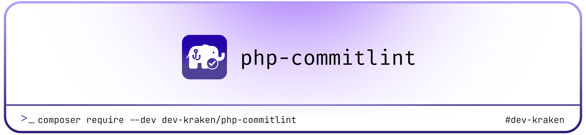

<a href="https://devkraken.com/">
  <picture>
    <source media="(prefers-color-scheme: dark)" srcset="banner/banner_dark.png">
    
  </picture>
</a>

# PHP CommitLint 🎯

A powerful Git hooks and commit message linting tool for PHP projects - combining the best of husky and commitlint in a native PHP implementation.

[](https://www.php.net/)
[](LICENSE)
[](https://github.com/devkraken/php-commitlint/actions)
[](https://pestphp.com/)

## 🚀 Features

- **🎯 Commit Message Validation** - Enforce conventional commit format with customizable rules
- **🪝 Git Hooks Management** - Easy installation and management of Git hooks
- **⚙️ Flexible Configuration** - Configure via `.commitlintrc.json` or `composer.json`
- **🔧 Developer Friendly** - Beautiful CLI output with helpful error messages
- **📦 Zero Dependencies** - Pure PHP implementation using only Symfony Console
- **🧪 Fully Tested** - Comprehensive test suite with Pest
- **🎨 Modern PHP** - PHP 8.3+ with strict types and modern syntax
- **🔒 Security First** - Built-in security features and input validation
- **🎛️ Custom Hooks** - Add your own git hooks with custom commands

## 📦 Installation

Install via Composer:

```bash
composer require --dev dev-kraken/php-commitlint
```

## 🔧 Quick Start

### 1. Install Git Hooks

```bash
vendor/bin/php-commitlint install
```

### 2. Start Making Commits!

```bash
# ✅ Valid commits
git commit -m "feat: add user authentication"
git commit -m "fix(auth): resolve login validation issue"
git commit -m "docs: update README with examples"

# ❌ Invalid commits (will be rejected)
git commit -m "added new feature"  # Missing type
git commit -m "FIX: something"     # Invalid type case
```

## 📋 Commands

### Install Hooks

Install Git hooks and create default configuration:

```bash
vendor/bin/php-commitlint install [options]
```

**Options:**
- `--force, -f` - Force installation even if hooks already exist
- `--skip-config` - Skip creating default configuration file

### Validate Commit Message

Validate commit messages against your configuration:

```bash
# Validate current commit message (from .git/COMMIT_EDITMSG)
vendor/bin/php-commitlint validate

# Validate specific message
vendor/bin/php-commitlint validate "feat: add new feature"

# Validate from file
vendor/bin/php-commitlint validate --file=commit.txt

# Quiet mode (exit code only)
vendor/bin/php-commitlint validate --quiet

# Verbose error details
vendor/bin/php-commitlint validate --verbose-errors
```

**Options:**
- `--file, -f` - Read commit message from specific file
- `--quiet, -q` - Suppress output (exit code only)
- `--verbose-errors` - Show detailed error information

### Manage Custom Hooks

Add and manage custom Git hooks:

```bash
# Add custom hook
vendor/bin/php-commitlint add pre-commit "vendor/bin/pest"
vendor/bin/php-commitlint add pre-push "vendor/bin/phpstan analyse"

# Remove hook
vendor/bin/php-commitlint remove pre-commit [--force]

# List all hooks and configuration
vendor/bin/php-commitlint status

# Show detailed information
vendor/bin/php-commitlint status --verbose

# Show only hooks or config
vendor/bin/php-commitlint status --hooks-only
vendor/bin/php-commitlint status --config-only
```

### Uninstall

Remove all installed Git hooks:

```bash
vendor/bin/php-commitlint uninstall [--force]
```

## ⚙️ Configuration

PHP CommitLint can be configured via `.commitlintrc.json` file or within your `composer.json`. The tool automatically merges your custom configuration with sensible defaults.

### Configuration File Priority

1. `.commitlintrc.json` in your project root
2. `extra.php-commitlint` in `composer.json`
3. Default configuration

### Complete Configuration Reference

```json
{
  "auto_install": false,
  "rules": {
    "type": {
      "required": true,
      "allowed": ["feat", "fix", "docs", "style", "refactor", "perf", "test", "chore", "ci", "build", "revert"]
    },
    "scope": {
      "required": false,
      "allowed": []
    },
    "subject": {
      "min_length": 1,
      "max_length": 100,
      "case": "any",
      "end_with_period": false
    },
    "body": {
      "max_line_length": 100,
      "leading_blank": true
    },
    "footer": {
      "leading_blank": true
    }
  },
  "patterns": {
    "breaking_change": "/^BREAKING CHANGE:/",
    "issue_reference": "/(?:close[sd]?|fix(?:e[sd])?|resolve[sd]?)\\s+#\\d+/i"
  },
  "hooks": {
    "commit-msg": true,
    "pre-commit": false,
    "pre-push": false
  },
  "format": {
    "type": true,
    "scope": "optional",
    "description": true,
    "body": "optional",
    "footer": "optional"
  }
}
```

### Configuration Options Explained

#### General Settings

- **`auto_install`** (`boolean`, default: `false`) - Automatically install hooks when composer install/update runs

#### Rules Configuration

##### Type Rules (`rules.type`)
- **`required`** (`boolean`, default: `true`) - Whether commit type is required
- **`allowed`** (`array`, default: see above) - Array of allowed commit types

##### Scope Rules (`rules.scope`)
- **`required`** (`boolean`, default: `false`) - Whether commit scope is required
- **`allowed`** (`array`, default: `[]`) - Array of allowed scopes (empty = any scope allowed)

##### Subject Rules (`rules.subject`)
- **`min_length`** (`int`, default: `1`) - Minimum subject length
- **`max_length`** (`int`, default: `100`) - Maximum subject length
- **`case`** (`string`, default: `"any"`) - Case requirement: `"lower"`, `"upper"`, or `"any"`
- **`end_with_period`** (`boolean`, default: `false`) - Whether subject must end with period

##### Body Rules (`rules.body`)
- **`max_line_length`** (`int`, default: `100`) - Maximum line length for body (0 = no limit)
- **`leading_blank`** (`boolean`, default: `true`) - Require blank line between subject and body

##### Footer Rules (`rules.footer`)
- **`leading_blank`** (`boolean`, default: `true`) - Require blank line between body and footer

#### Pattern Validation (`patterns`)

Define custom regex patterns for additional validation:

```json
{
  "patterns": {
    "breaking_change": "/^BREAKING CHANGE:/",
    "issue_reference": "/(?:close[sd]?|fix(?:e[sd])?|resolve[sd]?)\\s+#\\d+/i",
    "ticket_reference": "/JIRA-\\d+/"
  }
}
```

#### Hook Configuration (`hooks`)

Control which Git hooks are installed:

```json
{
  "hooks": {
    "commit-msg": true,    // Validate commit messages
    "pre-commit": false,   // Run before commits
    "pre-push": false      // Run before pushes
  }
}
```

### Example Configurations

#### Minimal Configuration (`examples/commitlintrc.minimal.json`)

```json
{
  "rules": {
    "type": {
      "allowed": ["feat", "fix", "docs", "chore"]
    },
    "subject": {
      "max_length": 50
    }
  }
}
```

#### Strict Configuration (`examples/commitlintrc.strict.json`)

```json
{
  "auto_install": true,
  "rules": {
    "type": {
      "required": true,
      "allowed": ["feat", "fix", "docs", "test", "refactor", "chore"]
    },
    "scope": {
      "required": true,
      "allowed": ["auth", "api", "ui", "db", "config", "test", "docs"]
    },
    "subject": {
      "min_length": 10,
      "max_length": 50,
      "case": "lower",
      "end_with_period": false
    },
    "body": {
      "max_line_length": 72,
      "leading_blank": true
    },
    "footer": {
      "leading_blank": true
    }
  },
  "patterns": {
    "breaking_change": "/^BREAKING CHANGE:/",
    "issue_reference": "/(?:close[sd]?|fix(?:e[sd])?|resolve[sd]?)\\s+#\\d+/i",
    "ticket_reference": "/JIRA-\\d+/"
  },
  "hooks": {
    "commit-msg": true,
    "pre-commit": true,
    "pre-push": false
  }
}
```

### Configuration in `composer.json`

You can also configure PHP CommitLint in your `composer.json`:

```json
{
  "extra": {
    "php-commitlint": {
      "auto_install": true,
      "rules": {
        "type": {
          "allowed": ["feat", "fix", "docs", "test", "chore"]
        },
        "subject": {
          "max_length": 80
        }
      }
    }
  }
}
```

## 📝 Commit Message Format

This package enforces the [Conventional Commits](https://conventionalcommits.org/) specification:

```
<type>[optional scope]: <description>

[optional body]

[optional footer(s)]
```

### Examples

```bash
# Simple commit
feat: add user registration

# With scope
feat(auth): add JWT token validation

# With body and footer
feat(api): add user endpoints

Add comprehensive user management endpoints including:
- GET /api/users
- POST /api/users
- PUT /api/users/{id}
- DELETE /api/users/{id}

Closes #123

# Breaking change
feat(api)!: redesign user authentication

BREAKING CHANGE: The authentication API has been completely redesigned.
All existing tokens will be invalidated.

# Multiple footers
fix(auth): resolve token validation issue

The token validation was failing for users with special characters
in their usernames.

Fixes #456
Reviewed-by: @johndoe
```

### Default Commit Types

- **`feat`** - New features
- **`fix`** - Bug fixes
- **`docs`** - Documentation changes
- **`style`** - Code style changes (formatting, etc)
- **`refactor`** - Code refactoring
- **`perf`** - Performance improvements
- **`test`** - Adding or updating tests
- **`chore`** - Maintenance tasks
- **`ci`** - CI/CD changes
- **`build`** - Build system changes
- **`revert`** - Reverting previous commits

### Special Commit Types (Auto-Skip Validation)

The following commit types automatically skip validation:

- **Merge commits** - `Merge branch "feature" into main`
- **Revert commits** - `Revert "feat: add user authentication"`
- **Initial commits** - `Initial commit`
- **Fixup commits** - `fixup! feat: add user authentication`

## 🛠️ Development & Testing

### Running Tests

```bash
# Run all tests
composer test

# Run with coverage
vendor/bin/pest --coverage

# Run specific test file
vendor/bin/pest tests/Unit/ValidationServiceTest.php

# Run tests with filter
vendor/bin/pest --filter="validation"
```

### Code Quality

```bash
# Check code style
composer cs:check

# Fix code style
composer cs

# Run static analysis
composer analyse

# Run all checks
composer check
```

### Available Make Commands

```bash
make help              # Show available commands
make install           # Install dependencies
make test              # Run tests
make test-coverage     # Run tests with coverage
make lint              # Check code style
make fix               # Fix code style issues
make phpstan           # Run static analysis
make all               # Run all checks
make hooks-install     # Install git hooks
make demo              # Show tool demonstration
```

## 🔄 Integration with CI/CD

### GitHub Actions

```yaml
name: Tests

on: [push, pull_request]

jobs:
  test:
    runs-on: ubuntu-latest
    steps:
      - uses: actions/checkout@v4
      - name: Setup PHP
        uses: shivammathur/setup-php@v2
        with:
          php-version: 8.3
          coverage: xdebug
      - name: Install dependencies
        run: composer install --no-progress --no-suggest --prefer-dist --optimize-autoloader
      - name: Run tests
        run: composer test
      - name: Run static analysis
        run: composer analyse
      - name: Check code style
        run: composer cs:check
      - name: Validate commit messages
        run: vendor/bin/php-commitlint validate "${{ github.event.head_commit.message }}"
```

### GitLab CI

```yaml
stages:
  - test
  - validate

test:
  stage: test
  image: php:8.3
  before_script:
    - apt-get update && apt-get install -y git unzip
    - curl -sS https://getcomposer.org/installer | php -- --install-dir=/usr/local/bin --filename=composer
    - composer install
  script:
    - composer test
    - composer analyse

validate-commits:
  stage: validate
  image: php:8.3
  script:
    - composer install
    - vendor/bin/php-commitlint validate "$CI_COMMIT_MESSAGE"
```

## 🚨 Error Codes

PHP CommitLint uses specific exit codes for different error conditions:

- **`0`** - Success
- **`1`** - Validation failed
- **`2`** - Configuration error
- **`3`** - File system error
- **`4`** - Invalid argument
- **`5`** - Runtime error
- **`6`** - Permission denied
- **`7`** - Not a Git repository

## 🔒 Security Features

- **Input validation** for all commit message processing
- **Safe command execution** using Symfony Process component
- **Configuration validation** to prevent malicious configs
- **Path traversal protection** in file operations
- **File size limits** (100KB max for config files)
- **No eval() or dynamic code execution**
- **Command validation** prevents dangerous operations in custom hooks

## 🤝 Contributing

We welcome contributions! Please see our [Contributing Guide](CONTRIBUTING.md) for details.

### Quick Start for Contributors

1. Fork the repository
2. Create your feature branch (`git checkout -b feature/amazing-feature`)
3. Make your changes and add tests
4. Run the test suite (`composer test`)
5. Check code style (`composer cs:check`)
6. Run static analysis (`composer analyse`)
7. Commit your changes (`git commit -m "feat: add amazing feature"`)
8. Push to the branch (`git push origin feature/amazing-feature`)
9. Open a Pull Request

## 📄 License

This project is licensed under the MIT License - see the [LICENSE](LICENSE) file for details.

## 🙏 Acknowledgments

- Inspired by [husky](https://github.com/typicode/husky) and [commitlint](https://github.com/conventional-changelog/commitlint)
- Built with [Symfony Console](https://symfony.com/doc/current/components/console.html)
- Tested with [Pest](https://pestphp.com/)

## 📚 Documentation

- 📖 **[API Documentation](docs/API.md)** - Detailed API reference for developers
- ❓ **[FAQ](docs/FAQ.md)** - Frequently asked questions and troubleshooting
- 🤝 **[Contributing Guide](CONTRIBUTING.md)** - How to contribute to the project
- 📋 **[Changelog](CHANGELOG.md)** - Release notes and version history
- 🔒 **[Security Policy](SECURITY.md)** - Security guidelines and reporting

## 📞 Support

- 📧 Email: soman@devkraken.com
- 🐛 Issues: [GitHub Issues](https://github.com/dev-kraken/php-commitlint/issues)
- 💬 Discussions: [GitHub Discussions](https://github.com/dev-kraken/php-commitlint/discussions)
- ❓ FAQ: [Frequently Asked Questions](docs/FAQ.md)

---

Made with ❤️ by [DevKraken](https://github.com/dev-kraken)
